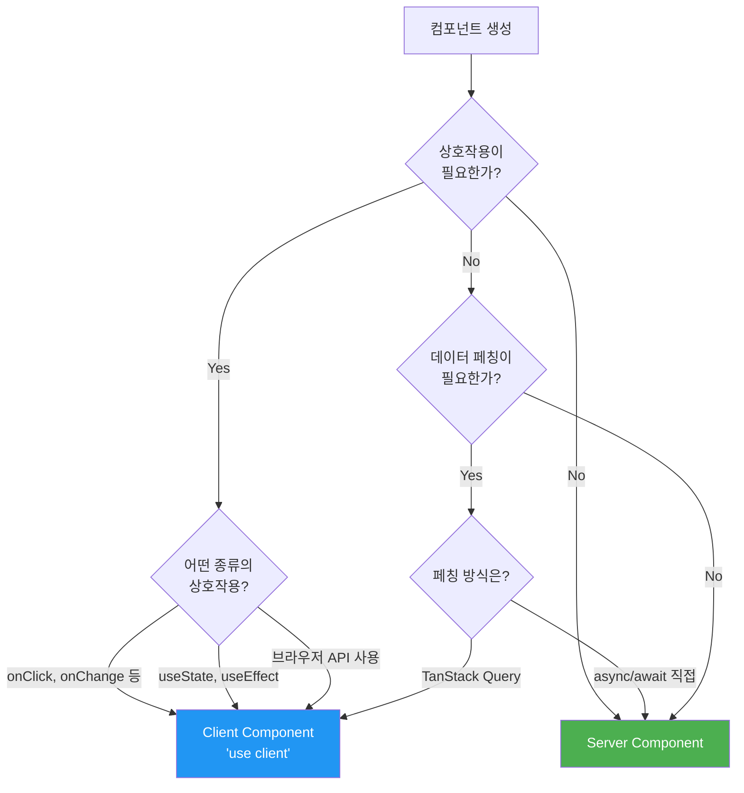

# Musinsa Wagon Frontend Architecture Document

## Template and Framework Selection

### 프론트엔드 스타터 템플릿 분석

**✅ 기존 프로젝트 상태:**

이 프로젝트는 **이미 구현된 Next.js 15.3.3 프론트엔드**를 사용하고 있습니다 (저장소: `musinsa-wagon-nextjs-react-ts-v2`).

**프레임워크 및 템플릿:**

- **프레임워크**: Next.js 15.3.3 with App Router
- **언어**: TypeScript (엄격한 타입 설정)
- **스타터 템플릿**: Next.js 공식 TypeScript 템플릿 기반

**프로젝트 설정 분석 (CLAUDE.md 기준):**

| 구성 요소           | 선택된 기술                           | 현재 상태    |
| ------------------- | ------------------------------------- | ------------ |
| **프레임워크**      | Next.js 15.3.3                        | ✅ 구성 완료 |
| **라우팅**          | App Router                            | ✅ 구성 완료 |
| **스타일링**        | Tailwind CSS v4.1.10 + shadcn/ui      | ✅ 구성 완료 |
| **상태 관리**       | Zustand (전역), TanStack Query (서버) | ✅ 구성 완료 |
| **HTTP 클라이언트** | Axios                                 | ✅ 구성 완료 |
| **UI 컴포넌트**     | shadcn/ui + Radix UI                  | ✅ 구성 완료 |
| **아이콘**          | Lucide React                          | ✅ 구성 완료 |
| **알림**            | Sonner (toast)                        | ✅ 구성 완료 |
| **테스팅**          | Vitest + Storybook + Playwright       | ✅ 구성 완료 |
| **코드 품질**       | ESLint, Prettier, Husky               | ✅ 구성 완료 |
| **패키지 매니저**   | pnpm                                  | ✅ 사용 중   |

**기존 디렉토리 구조:**

```
src/
├── apis/main/          # OpenAPI 생성 API 클라이언트
├── app/                # Next.js App Router 페이지
├── components/
│   ├── base/           # 기본 컴포넌트 (Badge, Button, Text)
│   ├── layout/         # 레이아웃 (Header, Footer, Navigation)
│   ├── ui/             # shadcn/ui 컴포넌트
│   └── provider/       # Context Providers
├── features/           # 기능 기반 구성
│   ├── auth/
│   ├── banner/
│   ├── category/
│   ├── notifications/
│   └── products/
├── hooks/              # 커스텀 React 훅
├── lib/                # 유틸리티 및 설정
├── queries/            # TanStack Query 훅
├── stores/             # Zustand 스토어
├── types/              # TypeScript 타입
├── utils/              # 범용 유틸리티
└── stories/            # Storybook 스토리
```

**주요 설정 파일:**

- `tsconfig.json`: 경로 매핑 (`@/*` → `src/*`), 엄격한 타입 설정
- `components.json`: shadcn/ui 설정 (New York 스타일, CSS 변수)
- `vitest.config.ts`: Storybook 통합 테스트
- `postcss.config.js`: Tailwind v4 설정

**선택 근거:**

**✅ 채택 이유:**

1. **Next.js 15.3.3**: 최신 App Router 기반, Server Components 지원, 프로덕션 최적화
2. **Tailwind CSS v4**: 최신 버전, 성능 최적화, shadcn/ui와 완벽 통합
3. **Zustand + TanStack Query**: 경량 전역 상태 + 강력한 서버 상태 관리 분리
4. **shadcn/ui**: 커스터마이징 가능, 접근성 우수, Radix UI 기반
5. **pnpm**: 빠른 설치 속도, 디스크 효율성, 모노레포 친화적

**⚠️ 제약사항:**

- Next.js App Router는 15.3.3 API 규칙을 따라야 함
- shadcn/ui는 New York 스타일로 고정
- TanStack Query v5 breaking changes 고려 필요
- OpenAPI Generator 출력 경로 고정 (`src/apis/main/`)

### 아키텍처 개선 사항

#### **1. API 클라이언트 계층 강화**

**중앙화된 API 클라이언트 설정:**

```typescript
// src/lib/api/client.ts
import axios from 'axios'
import { toast } from 'sonner'

export const apiClient = axios.create({
  baseURL: process.env.NEXT_PUBLIC_API_URL,
  timeout: 10000,
  headers: {
    'Content-Type': 'application/json',
  },
})

// Request Interceptor - 자동 토큰 첨부
apiClient.interceptors.request.use(
  (config) => {
    const token = localStorage.getItem('access_token')
    if (token) {
      config.headers.Authorization = `Bearer ${token}`
    }
    return config
  },
  (error) => Promise.reject(error)
)

// Response Interceptor - 401 처리 + 토큰 갱신
apiClient.interceptors.response.use(
  (response) => response,
  async (error) => {
    const originalRequest = error.config

    // 401 에러 + 리프레시 시도
    if (error.response?.status === 401 && !originalRequest._retry) {
      originalRequest._retry = true

      try {
        const refreshToken = localStorage.getItem('refresh_token')
        const { data } = await axios.post('/api/auth/refresh', { refreshToken })

        localStorage.setItem('access_token', data.accessToken)
        originalRequest.headers.Authorization = `Bearer ${data.accessToken}`

        return apiClient(originalRequest)
      } catch (refreshError) {
        // 리프레시 실패 시 로그아웃
        localStorage.clear()
        window.location.href = '/login'
        return Promise.reject(refreshError)
      }
    }

    // 에러 토스트 (네트워크 에러 제외)
    if (error.response) {
      toast.error(error.response.data.message || '요청 처리 중 오류가 발생했습니다.')
    }

    return Promise.reject(error)
  }
)
```

**장점:**

- ✅ 자동 토큰 갱신으로 사용자 경험 개선
- ✅ 중앙화된 에러 처리로 일관성 확보
- ✅ 재시도 로직 내장으로 안정성 향상

#### **2. 환경 변수 타입 안전성**

**타입 안전한 환경 변수 관리:**

```typescript
// src/lib/env.ts
import { z } from 'zod'

const envSchema = z.object({
  NEXT_PUBLIC_API_URL: z.string().url(),
  NEXT_PUBLIC_FCM_VAPID_KEY: z.string().min(1),
  NEXT_PUBLIC_ENV: z.enum(['dev', 'prod', 'local']),
})

// 빌드 타임에 검증
const parsedEnv = envSchema.safeParse({
  NEXT_PUBLIC_API_URL: process.env.NEXT_PUBLIC_API_URL,
  NEXT_PUBLIC_FCM_VAPID_KEY: process.env.NEXT_PUBLIC_FCM_VAPID_KEY,
  NEXT_PUBLIC_ENV: process.env.NEXT_PUBLIC_ENV,
})

if (!parsedEnv.success) {
  console.error('❌ Invalid environment variables:', parsedEnv.error.flatten().fieldErrors)
  throw new Error('Invalid environment variables')
}

export const env = parsedEnv.data
```

**사용 예시:**

```typescript
import { env } from '@/lib/env'

// 타입 안전하게 사용
const apiUrl = env.NEXT_PUBLIC_API_URL // string (never undefined)
```

**장점:**

- ✅ 빌드 타임에 환경 변수 누락 발견
- ✅ 타입 안전성 보장
- ✅ IDE 자동완성 지원

#### **3. Feature-based 구조 강화**

**개선된 Feature 모듈 구조:**

```
src/features/products/
├── index.ts              # Public API (외부로 export할 것만)
├── components/
│   ├── ProductCard.tsx
│   ├── ProductList.tsx
│   └── ProductDetail.tsx
├── hooks/
│   ├── useProduct.ts     # TanStack Query 훅
│   └── useWatchlist.ts
├── stores/
│   └── productFilterStore.ts  # Zustand store
├── types/
│   └── product.types.ts
└── utils/
    └── priceFormatter.ts
```

**Public API 패턴:**

```typescript
// src/features/products/index.ts
export { ProductCard } from './components/ProductCard'
export { ProductList } from './components/ProductList'
export { useProduct } from './hooks/useProduct'
export type { Product, PriceHistory } from './types/product.types'

// 내부 구현은 export하지 않음 (캡슐화)
```

**장점:**

- ✅ 의존성 명확화 (순환 참조 방지)
- ✅ 코드 재사용성 증가
- ✅ 기능별 독립적 테스트 가능

#### **4. TanStack Query 최적화**

**Query Key 팩토리 패턴:**

```typescript
// src/queries/queryKeys.ts
export const queryKeys = {
  products: {
    all: ['products'] as const,
    lists: () => [...queryKeys.products.all, 'list'] as const,
    list: (filters: ProductFilters) => [...queryKeys.products.lists(), filters] as const,
    details: () => [...queryKeys.products.all, 'detail'] as const,
    detail: (id: number) => [...queryKeys.products.details(), id] as const,
    priceHistory: (id: number) => [...queryKeys.products.detail(id), 'priceHistory'] as const,
  },
  watchlist: {
    all: ['watchlist'] as const,
    list: () => [...queryKeys.watchlist.all, 'list'] as const,
  },
} as const
```

**Query 훅 예시:**

```typescript
// src/features/products/hooks/useProduct.ts
import { queryKeys } from '@/queries/queryKeys'
import { useQuery } from '@tanstack/react-query'

export function useProduct(id: number) {
  return useQuery({
    queryKey: queryKeys.products.detail(id),
    queryFn: () => productApi.getById(id),
    staleTime: 5 * 60 * 1000, // 5분간 fresh
    gcTime: 10 * 60 * 1000, // 10분간 캐시 유지
  })
}

// 가격 히스토리는 별도 쿼리 (독립적 갱신)
export function usePriceHistory(productId: number) {
  return useQuery({
    queryKey: queryKeys.products.priceHistory(productId),
    queryFn: () => productApi.getPriceHistory(productId),
    staleTime: 1 * 60 * 1000, // 1분 (더 짧은 주기)
  })
}
```

**Prefetching 활용:**

```typescript
// src/app/products/page.tsx
export default async function ProductsPage() {
  const queryClient = getQueryClient();

  // 서버 컴포넌트에서 prefetch
  await queryClient.prefetchQuery({
    queryKey: queryKeys.products.list({ category: 'all' }),
    queryFn: () => productApi.getList({ category: 'all' }),
  });

  return (
    <HydrationBoundary state={dehydrate(queryClient)}>
      <ProductList />
    </HydrationBoundary>
  );
}
```

**장점:**

- ✅ Query key 충돌 방지 (타입 안전)
- ✅ 캐시 무효화 용이
- ✅ SSR/SSG 최적화

#### **5. Error Boundary 계층화**

**기능별 에러 격리:**

```typescript
// src/components/error-boundary/FeatureErrorBoundary.tsx
'use client';

import { Component, ReactNode } from 'react';
import { Button } from '@/components/ui/button';

interface Props {
  children: ReactNode;
  fallback?: ReactNode;
  featureName?: string;
}

interface State {
  hasError: boolean;
  error?: Error;
}

export class FeatureErrorBoundary extends Component<Props, State> {
  constructor(props: Props) {
    super(props);
    this.state = { hasError: false };
  }

  static getDerivedStateFromError(error: Error): State {
    return { hasError: true, error };
  }

  componentDidCatch(error: Error, errorInfo: React.ErrorInfo) {
    console.error(`[${this.props.featureName || 'Feature'}] Error:`, error, errorInfo);

    // 에러 로깅 서비스에 전송 (예: Sentry)
    // logErrorToService(error, errorInfo);
  }

  render() {
    if (this.state.hasError) {
      if (this.props.fallback) {
        return this.props.fallback;
      }

      return (
        <div className="p-4 border border-red-200 rounded-lg bg-red-50">
          <h3 className="text-red-800 font-semibold mb-2">
            {this.props.featureName || '기능'} 로딩 중 오류 발생
          </h3>
          <p className="text-red-600 text-sm mb-3">
            일시적인 문제가 발생했습니다. 다시 시도해 주세요.
          </p>
          <Button
            variant="outline"
            size="sm"
            onClick={() => this.setState({ hasError: false })}
          >
            다시 시도
          </Button>
        </div>
      );
    }

    return this.props.children;
  }
}
```

**사용 예시:**

```typescript
// src/app/page.tsx
import { FeatureErrorBoundary } from '@/components/error-boundary';
import { BannerCarousel } from '@/features/banner';
import { ProductRecommendations } from '@/features/products';

export default function HomePage() {
  return (
    <div>
      <FeatureErrorBoundary featureName="배너">
        <BannerCarousel />
      </FeatureErrorBoundary>

      <FeatureErrorBoundary featureName="추천 상품">
        <ProductRecommendations />
      </FeatureErrorBoundary>
    </div>
  );
}
```

**장점:**

- ✅ 부분 장애 격리 (한 기능 에러가 전체에 영향 없음)
- ✅ 사용자 친화적 에러 메시지
- ✅ 에러 로깅 중앙화

#### **6. Performance Monitoring**

**Core Web Vitals 측정:**

```typescript
// src/lib/monitoring/performance.ts
export function measurePageLoad() {
  if (typeof window === 'undefined') return

  // Core Web Vitals 측정
  const observer = new PerformanceObserver((list) => {
    for (const entry of list.getEntries()) {
      const metric = entry as PerformanceEntry & {
        name: string
        value: number
      }

      console.log(`[Web Vital] ${metric.name}:`, metric.value)

      // 분석 도구에 전송 (예: Google Analytics)
      // gtag('event', metric.name, { value: metric.value });
    }
  })

  observer.observe({
    entryTypes: ['largest-contentful-paint', 'first-input', 'layout-shift'],
  })
}
```

### 개선 우선순위

| 우선순위      | 개선 항목                | 영향도 | 구현 난이도 | 예상 시간 |
| ------------- | ------------------------ | ------ | ----------- | --------- |
| **🔴 High**   | API 클라이언트 토큰 갱신 | 높음   | 중간        | 2시간     |
| **🔴 High**   | 환경 변수 타입 안전성    | 높음   | 낮음        | 1시간     |
| **🟡 Medium** | Query Key 팩토리         | 중간   | 중간        | 3시간     |
| **🟡 Medium** | Error Boundary 계층화    | 중간   | 낮음        | 2시간     |
| **🟢 Low**    | Feature 구조 강화        | 낮음   | 높음        | 8시간     |
| **🟢 Low**    | Performance Monitoring   | 낮음   | 낮음        | 1시간     |

### Change Log

| Date       | Version | Description                                               | Author              |
| ---------- | ------- | --------------------------------------------------------- | ------------------- |
| 2025-01-29 | 1.0     | Frontend architecture document creation with improvements | Winston (Architect) |

## Frontend Tech Stack

이 섹션은 [docs/architecture.md](docs/architecture.md)의 Technology Stack Table과 **동기화되어야 합니다**. 변경 시 양쪽 문서를 모두 업데이트해야 합니다.

### Technology Stack Table

| Category                 | Technology             | Version     | Purpose                           | Rationale                                           |
| ------------------------ | ---------------------- | ----------- | --------------------------------- | --------------------------------------------------- |
| **Framework**            | Next.js                | 15.3.3      | React 기반 풀스택 프레임워크      | App Router, 서버 컴포넌트, SEO 최적화, 이미 설정됨  |
| **Language**             | TypeScript             | 5.3.3       | 정적 타입 체크                    | 타입 안전성, 대규모 코드베이스 유지보수성           |
| **Runtime**              | Node.js                | 20.11.0 LTS | JavaScript 런타임                 | LTS 버전 (2026년 4월까지 지원), Next.js 호환성      |
| **UI Styling**           | Tailwind CSS           | 4.1.10      | 유틸리티 우선 CSS 프레임워크      | 빠른 UI 개발, 일관된 디자인 시스템, v4 최신 기능    |
| **UI Components**        | shadcn/ui              | Latest      | Radix UI 기반 컴포넌트 라이브러리 | 접근성 우수, 커스터마이징 가능, Tailwind 완벽 통합  |
| **UI Primitives**        | Radix UI               | Latest      | Headless UI 라이브러리            | shadcn/ui 기반, WAI-ARIA 준수, 접근성               |
| **State Management**     | Zustand                | 4.5.0       | 전역 상태 관리                    | 경량 (3KB), 간단한 API, React 18 호환               |
| **Server State**         | TanStack Query         | 5.28.0      | 서버 상태 관리 및 캐싱            | 자동 리페칭, 캐시 무효화, Optimistic UI             |
| **HTTP Client**          | Axios                  | 1.6.7       | HTTP 요청 라이브러리              | 인터셉터 지원, 타임아웃, 자동 JSON 변환             |
| **API Client Generator** | OpenAPI Generator      | 7.4.0       | TypeScript 클라이언트 자동 생성   | 백엔드 Swagger와 타입 동기화                        |
| **Form Handling**        | React Hook Form        | 7.51.0      | 폼 상태 관리                      | 성능 최적화 (비제어 컴포넌트), Validation 통합      |
| **Form Validation**      | Zod                    | 3.22.4      | 스키마 검증 라이브러리            | TypeScript 우선 설계, 타입 추론, 런타임 검증        |
| **Charts**               | Recharts               | 2.12.0      | React 차트 라이브러리             | 가격 히스토리 그래프, 선언적 API, 반응형            |
| **Icons**                | Lucide React           | 0.344.0     | 아이콘 라이브러리                 | 일관된 디자인, 트리 셰이킹 지원, shadcn/ui 통합     |
| **Notifications**        | Sonner                 | 1.4.3       | Toast 알림                        | 우아한 UX, 접근성, shadcn/ui 스타일 호환            |
| **Date Handling**        | date-fns               | 3.3.1       | 날짜 유틸리티                     | 경량, 트리 셰이킹, Immutable, Moment.js 대체        |
| **Utilities**            | clsx                   | 2.1.0       | 조건부 클래스명                   | Tailwind 동적 클래스 생성                           |
| **Utilities**            | tailwind-merge         | 2.2.1       | Tailwind 클래스 병합              | 중복 클래스 제거, clsx와 함께 사용 (cn 함수)        |
| **Package Manager**      | pnpm                   | 8.15.0      | 패키지 관리자                     | 빠른 설치, 디스크 효율 (심볼릭 링크), 엄격한 의존성 |
|                          |                        |             |                                   |                                                     |
| **Code Quality**         | ESLint                 | 8.57.0      | JavaScript/TypeScript 린터        | 코드 품질 유지, Next.js 권장 규칙                   |
| **Code Formatting**      | Prettier               | 3.2.5       | 코드 포맷터                       | 일관된 코드 스타일, ESLint 통합                     |
| **Git Hooks**            | Husky                  | 9.0.11      | Git 훅 관리                       | pre-commit 시 린트/포맷 자동 실행                   |
| **Staged Files Linting** | lint-staged            | 15.2.2      | 스테이지 파일만 린트              | 커밋 전 변경 파일만 검사 (성능)                     |
|                          |                        |             |                                   |                                                     |
| **Unit Testing**         | Vitest                 | 1.3.1       | 단위 테스트 프레임워크            | Vite 기반 (빠름), Jest 호환 API, ESM 네이티브       |
| **UI Testing**           | Storybook              | 8.0.0       | 컴포넌트 개발 환경                | 격리된 컴포넌트 개발, 시각적 테스트, 문서화         |
| **E2E Testing**          | Playwright             | 1.42.0      | 엔드투엔드 테스트                 | 크로스 브라우저, 네트워크 모킹, Next.js 호환        |
| **Testing Library**      | @testing-library/react | 14.2.1      | 컴포넌트 테스트 유틸              | 사용자 중심 테스트, 접근성 우선                     |

### 추가 의존성 (개선 사항 반영)

개선 제안에 따라 추가된 의존성:

| Category           | Technology    | Version | Purpose           | Rationale                                                  |
| ------------------ | ------------- | ------- | ----------------- | ---------------------------------------------------------- |
| **환경 변수 검증** | Zod           | 3.22.4  | 빌드타임 env 검증 | 타입 안전성, 런타임 검증, 이미 React Hook Form에서 사용 중 |
| **Error Tracking** | Sentry (선택) | Latest  | 에러 모니터링     | 프로덕션 에러 추적, 성능 모니터링 (선택적 도입)            |

### 기술 선택 근거

#### 1. Next.js 15.3.3 App Router

- ✅ 이미 프로젝트에 설정되어 있음 (기존 코드베이스 활용)
- ✅ Server Components로 초기 로딩 속도 개선
- ✅ App Router의 레이아웃 시스템으로 공통 UI (헤더, 푸터) 관리
- ✅ SEO 최적화 (상품 상세 페이지 SSR)

#### 2. Tailwind CSS v4 + shadcn/ui

- ✅ 최신 Tailwind v4 성능 최적화
- ✅ shadcn/ui는 코드 소유권 제공 (node_modules가 아닌 프로젝트 내부)
- ✅ New York 스타일 일관성 (CLAUDE.md 확인)
- ✅ Radix UI 기반으로 접근성 보장

#### 3. Zustand + TanStack Query 분리 전략

- ✅ **Zustand**: UI 상태 (필터, 모달, 토글 등 클라이언트 전용)
- ✅ **TanStack Query**: 서버 데이터 (상품, 가격, 찜 목록)
- ✅ 역할 분리로 복잡도 감소

**상태 관리 결정 트리:**

```
데이터의 출처는?
├─ 서버 API → TanStack Query
│  └─ 예: 상품 목록, 사용자 정보, 가격 히스토리
└─ 클라이언트 UI → Zustand
   └─ 예: 필터 상태, 사이드바 열림/닫힘, 다크모드
```

#### 4. OpenAPI Generator

- ✅ 백엔드 Swagger 스펙에서 TypeScript 클라이언트 자동 생성
- ✅ `src/apis/main/`에 출력 (CLAUDE.md 확인)
- ✅ 타입 불일치 방지 (백엔드 DTO와 프론트엔드 타입 동기화)

#### 5. React Hook Form + Zod

- ✅ 비제어 컴포넌트로 성능 최적화 (불필요한 리렌더링 방지)
- ✅ Zod 스키마로 백엔드 검증 규칙 복제 (클라이언트 측 빠른 피드백)
- ✅ TypeScript 타입 자동 추론

#### 6. Vitest + Playwright 조합

- ✅ **Vitest**: 빠른 단위 테스트 (Vite 기반, HMR 지원)
- ✅ **Playwright**: E2E 신뢰성 높음 (Puppeteer보다 안정적)
- ✅ 이미 CLAUDE.md에 설정 완료

#### 7. pnpm

- ✅ 이미 프로젝트에서 사용 중
- ✅ npm/yarn보다 2-3배 빠른 설치 속도
- ✅ 디스크 공간 절약 (심볼릭 링크)

### 버전 핀닝 전략

**중요:** 모든 의존성은 정확한 버전을 명시합니다.

- **LTS 우선**: Node.js 20.11.0 (2026년 4월까지 지원)
- **정확한 버전 명시**: "latest" 금지, 재현 가능한 빌드 보장
- **호환성 검증**: Next.js 15.3.3 + React 18 + TypeScript 5.3.3 조합 검증됨
- **마이너 버전 고정**: package.json에서 `^` 대신 정확한 버전 권장 (예: `"next": "15.3.3"`)

### 프론트엔드 개발 도구

| Tool                    | Version | Purpose                             |
| ----------------------- | ------- | ----------------------------------- |
| VS Code                 | 1.87+   | 권장 에디터 (ESLint, Prettier 확장) |
| Chrome DevTools         | Latest  | 디버깅, 네트워크 분석               |
| React DevTools          | Latest  | 컴포넌트 트리, Props 검사           |
| TanStack Query DevTools | 내장    | 쿼리 캐시 상태 확인                 |
| Storybook               | 8.0.0   | 컴포넌트 개발 환경                  |

## Project Structure

Next.js 15.3.3 App Router 기반의 정확한 디렉토리 구조를 정의합니다.

### 전체 프로젝트 구조

```
musinsa-wagon-nextjs-react-ts-v2/
├── .bmad-core/               # BMad 에이전트 설정 (개발 도구)
├── .claude/                  # Claude 설정
├── .gemini/                  # Gemini 설정
├── .git/                     # Git 버전 관리
├── .husky/                   # Git hooks (pre-commit)
│   └── pre-commit           # lint-staged 실행
├── .next/                    # Next.js 빌드 출력 (gitignore)
├── .storybook/               # Storybook 설정
│   ├── main.ts              # Storybook 메인 설정
│   └── preview.ts           # 글로벌 데코레이터
├── docs/                     # 프로젝트 문서
│   ├── architecture.md      # 백엔드 아키텍처 문서
│   └── ui-architecture.md   # 프론트엔드 아키텍처 문서 (이 문서)
├── node_modules/             # npm 패키지 (gitignore)
├── public/                   # 정적 파일 (이미지, 폰트 등)
│   ├── favicon.ico
│   └── images/
├── src/                      # 소스 코드 루트
│   ├── apis/                # API 클라이언트
│   │   └── main/            # OpenAPI Generator 출력
│   │       ├── apis/        # API 엔드포인트 클라이언트
│   │       ├── models/      # DTO 타입 정의
│   │       └── index.ts     # 자동 생성된 export
│   │
│   ├── app/                 # Next.js App Router
│   │   ├── (main)/          # 메인 레이아웃 그룹 ⭐ 권장 패턴
│   │   │   ├── layout.tsx   # 공통 레이아웃 (Header + Footer)
│   │   │   ├── page.tsx     # 홈페이지
│   │   │   ├── products/    # 상품 관련 페이지
│   │   │   │   ├── [id]/    # 동적 라우트 (상품 상세)
│   │   │   │   │   ├── page.tsx
│   │   │   │   │   ├── loading.tsx
│   │   │   │   │   └── error.tsx
│   │   │   │   ├── page.tsx
│   │   │   │   ├── loading.tsx
│   │   │   │   └── not-found.tsx
│   │   │   └── watchlist/   # 찜 목록 페이지
│   │   │       └── page.tsx
│   │   │
│   │   ├── (auth)/          # 인증 레이아웃 그룹 ⭐ 권장 패턴
│   │   │   ├── layout.tsx   # 인증 전용 레이아웃 (헤더/푸터 없음)
│   │   │   ├── login/
│   │   │   │   └── page.tsx
│   │   │   └── signup/
│   │   │       └── page.tsx
│   │   │
│   │   ├── layout.tsx       # 루트 레이아웃 (전역 설정)
│   │   ├── error.tsx        # 전역 에러 페이지
│   │   └── not-found.tsx    # 전역 404 페이지
│   │
│   ├── components/          # 재사용 가능한 컴포넌트
│   │   ├── base/            # 기본 컴포넌트 (커스텀)
│   │   │   ├── Badge.tsx
│   │   │   ├── Button.tsx
│   │   │   └── Text.tsx
│   │   │
│   │   ├── layout/          # 레이아웃 컴포넌트
│   │   │   ├── Header.tsx
│   │   │   ├── Footer.tsx
│   │   │   ├── Navigation.tsx
│   │   │   └── Sidebar.tsx
│   │   │
│   │   ├── ui/              # shadcn/ui 컴포넌트 (자동 생성)
│   │   │   ├── button.tsx   # shadcn/ui Button
│   │   │   ├── card.tsx
│   │   │   ├── dialog.tsx
│   │   │   ├── input.tsx
│   │   │   ├── skeleton.tsx # 로딩 스켈레톤
│   │   │   ├── toast.tsx
│   │   │   └── ...          # 기타 shadcn/ui 컴포넌트
│   │   │
│   │   ├── provider/        # Context Providers
│   │   │   ├── QueryClientProvider.tsx  # TanStack Query
│   │   │   └── ViewportProvider.tsx     # 반응형 뷰포트
│   │   │
│   │   └── error-boundary/  # 에러 경계 (개선 사항)
│   │       └── FeatureErrorBoundary.tsx
│   │
│   ├── features/            # 기능 기반 모듈 구조 ⭐ Colocation 패턴
│   │   ├── auth/            # 인증 기능
│   │   │   ├── index.ts     # Public API
│   │   │   ├── components/
│   │   │   │   ├── LoginForm/
│   │   │   │   │   ├── LoginForm.tsx
│   │   │   │   │   ├── LoginForm.test.tsx
│   │   │   │   │   └── LoginForm.stories.tsx
│   │   │   │   └── SignupForm/
│   │   │   │       ├── SignupForm.tsx
│   │   │   │       └── SignupForm.test.tsx
│   │   │   ├── hooks/
│   │   │   │   ├── useLogin.ts
│   │   │   │   └── useSignup.ts
│   │   │   ├── stores/
│   │   │   │   └── authStore.ts  # Zustand (토큰, 사용자 정보)
│   │   │   └── types/
│   │   │       └── auth.types.ts
│   │   │
│   │   ├── banner/          # 배너/캐러셀
│   │   │   ├── index.ts
│   │   │   └── components/
│   │   │       └── BannerCarousel/
│   │   │           ├── BannerCarousel.tsx
│   │   │           └── BannerCarousel.stories.tsx
│   │   │
│   │   ├── category/        # 카테고리 네비게이션
│   │   │   ├── index.ts
│   │   │   └── components/
│   │   │       ├── CategoryNav/
│   │   │       │   └── CategoryNav.tsx
│   │   │       └── CategoryMenu/
│   │   │           └── CategoryMenu.tsx
│   │   │
│   │   ├── notifications/   # 알림 시스템
│   │   │   ├── index.ts
│   │   │   ├── components/
│   │   │   │   └── NotificationList/
│   │   │   │       ├── NotificationList.tsx
│   │   │   │       └── NotificationList.test.tsx
│   │   │   ├── hooks/
│   │   │   │   └── useNotifications.ts  # TanStack Query
│   │   │   └── types/
│   │   │       └── notification.types.ts
│   │   │
│   │   └── products/        # 상품 기능
│   │       ├── index.ts     # Public API
│   │       ├── components/
│   │       │   ├── ProductCard/
│   │       │   │   ├── ProductCard.tsx
│   │       │   │   ├── ProductCard.test.tsx
│   │       │   │   ├── ProductCard.stories.tsx
│   │       │   │   └── useProductCard.ts  # 컴포넌트 전용 훅
│   │       │   ├── ProductList/
│   │       │   │   ├── ProductList.tsx
│   │       │   │   └── ProductList.test.tsx
│   │       │   ├── ProductDetail/
│   │       │   │   └── ProductDetail.tsx
│   │       │   └── PriceHistoryChart/
│   │       │       ├── PriceHistoryChart.tsx
│   │       │       └── PriceHistoryChart.stories.tsx
│   │       ├── hooks/
│   │       │   ├── useProduct.ts        # TanStack Query
│   │       │   ├── usePriceHistory.ts   # TanStack Query
│   │       │   └── useWatchlist.ts      # TanStack Query
│   │       ├── stores/
│   │       │   └── productFilterStore.ts  # Zustand (필터 상태)
│   │       ├── types/
│   │       │   └── product.types.ts
│   │       └── utils/
│   │           ├── priceFormatter.ts
│   │           └── priceLabel.ts
│   │
│   ├── hooks/               # 범용 커스텀 훅
│   │   ├── useDebounce.ts
│   │   ├── useLocalStorage.ts
│   │   └── useMediaQuery.ts
│   │
│   ├── lib/                 # 유틸리티 및 설정
│   │   ├── api/             # API 클라이언트 (개선 사항)
│   │   │   └── client.ts    # Axios 인터셉터 설정
│   │   ├── env.ts           # 환경 변수 검증 (개선 사항)
│   │   ├── utils.ts         # cn() 함수 (clsx + tailwind-merge)
│   │   └── monitoring/      # 성능 모니터링 (개선 사항)
│   │       └── performance.ts
│   │
│   ├── queries/             # TanStack Query 관련
│   │   ├── queryKeys.ts     # Query Key 팩토리 (개선 사항)
│   │   └── queryClient.ts   # QueryClient 설정
│   │
│   ├── stores/              # Zustand 전역 스토어
│   │   ├── uiStore.ts       # UI 상태 (모달, 사이드바 등)
│   │   └── themeStore.ts    # 다크모드 등
│   │
│   ├── types/               # 공통 TypeScript 타입
│   │   ├── api.types.ts     # API 공통 타입
│   │   └── common.types.ts  # 범용 타입
│   │
│   ├── utils/               # 범용 유틸리티 함수
│   │   ├── formatters.ts    # 날짜, 가격 포맷팅
│   │   └── validators.ts    # 검증 함수
│   │
│   └── stories/             # Storybook 스토리 (Colocation 대안)
│       ├── Button.stories.tsx
│       └── ProductCard.stories.tsx
│
├── .env.development         # 개발 환경 변수
├── .env.production          # 프로덕션 환경 변수
├── .env.local               # 로컬 환경 변수
├── .eslintrc.json           # ESLint 설정
├── .gitignore               # Git ignore
├── .prettierrc              # Prettier 설정
├── CLAUDE.md                # Claude 지침 (이미 존재)
├── components.json          # shadcn/ui 설정
├── next.config.js           # Next.js 설정
├── package.json             # npm 의존성
├── pnpm-lock.yaml           # pnpm 잠금 파일
├── postcss.config.js        # PostCSS 설정 (Tailwind)
├── README.md                # 프로젝트 README
├── tsconfig.json            # TypeScript 설정
└── vitest.config.ts         # Vitest 설정
```

---

### 디렉토리 구조 원칙

#### **1. App Router 라우트 그룹 패턴 ⭐**

**권장: (main) / (auth) 그룹 분리**

```typescript
// app/(main)/layout.tsx - 메인 레이아웃
export default function MainLayout({ children }) {
  return (
    <>
      <Header />
      <main className="min-h-screen">{children}</main>
      <Footer />
    </>
  );
}

// app/(auth)/layout.tsx - 인증 레이아웃
export default function AuthLayout({ children }) {
  return (
    <div className="min-h-screen flex items-center justify-center bg-gray-50">
      {children}
    </div>
  );
}
```

**장점:**

- ✅ 레이아웃별 명확한 분리 (메인: 헤더+푸터, 인증: 중앙 정렬)
- ✅ URL에 영향 없음 (`/login`, `/signup` 유지)
- ✅ 향후 관리자 페이지 추가 시 `(admin)/` 그룹으로 확장 용이

---

#### **2. 서버/클라이언트 컴포넌트 분리 전략 ⭐**

**Next.js 15 권장: 기본은 서버 컴포넌트**

| 컴포넌트 유형            | 서버/클라이언트             | 예시                        |
| ------------------------ | --------------------------- | --------------------------- |
| **페이지 (`app/`)**      | 서버 컴포넌트 (기본)        | `app/products/page.tsx`     |
| **데이터 페칭 컴포넌트** | 서버 컴포넌트               | `ProductList` (데이터 전달) |
| **상호작용 컴포넌트**    | 클라이언트 (`'use client'`) | `ProductCard` (찜 버튼)     |
| **TanStack Query 사용**  | 클라이언트 (필수)           | `useProduct()` 훅           |

**권장 패턴:**

```typescript
// ✅ 서버 컴포넌트 (app/products/page.tsx)
import { Metadata } from 'next';
import { HydrationBoundary, dehydrate } from '@tanstack/react-query';
import { getQueryClient } from '@/queries/queryClient';
import { queryKeys } from '@/queries/queryKeys';
import { ProductList } from '@/features/products';

// SEO 메타데이터
export const metadata: Metadata = {
  title: '상품 목록 | Musinsa Wagon',
  description: '무신사 상품 가격 추적 및 역대 최저가 알림',
};

export default async function ProductsPage() {
  const queryClient = getQueryClient();

  // 서버에서 prefetch (초기 HTML에 데이터 포함)
  await queryClient.prefetchQuery({
    queryKey: queryKeys.products.list({ category: 'all' }),
    queryFn: () => fetchProducts({ category: 'all' }),
  });

  return (
    <HydrationBoundary state={dehydrate(queryClient)}>
      <ProductList />  {/* 클라이언트 컴포넌트가 캐시 사용 */}
    </HydrationBoundary>
  );
}

// ✅ 클라이언트 컴포넌트 (features/products/components/ProductList.tsx)
'use client';

import { useProducts } from '@/features/products/hooks/useProducts';

export function ProductList() {
  // 서버에서 prefetch한 데이터 사용 (캐시 히트)
  const { data: products } = useProducts({ category: 'all' });

  return (
    <div>
      {products.map(product => (
        <ProductCard key={product.id} product={product} />
      ))}
    </div>
  );
}
```

**장점:**

- ✅ 초기 HTML에 데이터 포함 (SEO 최적화)
- ✅ 클라이언트에서 캐시 활용 (빠른 네비게이션)
- ✅ 자동 리페칭으로 최신 데이터 유지

---

#### **3. 로딩 및 에러 처리 파일 컨벤션 ⭐**

**Next.js 15 권장: 페이지별 loading.tsx / error.tsx**

```
app/products/
├── page.tsx          # 메인 페이지
├── loading.tsx       # Suspense fallback (자동 적용)
├── error.tsx         # Error Boundary (자동 적용)
└── not-found.tsx     # 404 페이지
```

**권장 구현:**

```typescript
// ✅ app/products/loading.tsx
import { Skeleton } from '@/components/ui/skeleton';

export default function Loading() {
  return (
    <div className="space-y-4">
      <Skeleton className="h-12 w-full" />
      <Skeleton className="h-64 w-full" />
      <Skeleton className="h-64 w-full" />
    </div>
  );
}

// ✅ app/products/error.tsx
'use client';  // Error 컴포넌트는 반드시 클라이언트

import { Button } from '@/components/ui/button';

export default function Error({ error, reset }: { error: Error; reset: () => void }) {
  return (
    <div className="flex flex-col items-center justify-center min-h-[400px] space-y-4">
      <h2 className="text-2xl font-bold text-red-600">상품 로딩 중 오류 발생</h2>
      <p className="text-gray-600">{error.message}</p>
      <Button onClick={reset}>다시 시도</Button>
    </div>
  );
}

// ✅ app/products/not-found.tsx
export default function NotFound() {
  return (
    <div className="text-center py-12">
      <h2 className="text-xl font-semibold">상품을 찾을 수 없습니다</h2>
    </div>
  );
}
```

---

#### **4. Feature 모듈 구조 (Colocation 패턴) ⭐**

**권장: 관련 파일을 컴포넌트 폴더 내부에 배치**

```
features/products/components/ProductCard/
├── ProductCard.tsx          # 메인 컴포넌트
├── ProductCard.test.tsx     # 단위 테스트
├── ProductCard.stories.tsx  # Storybook 스토리
└── useProductCard.ts        # 컴포넌트 전용 훅
```

**Public API 패턴:**

```typescript
// src/features/products/index.ts
// 외부에 노출할 것만 export (캡슐화)
export { ProductCard } from './components/ProductCard/ProductCard'
export { ProductList } from './components/ProductList/ProductList'
export { ProductDetail } from './components/ProductDetail/ProductDetail'
export { useProduct } from './hooks/useProduct'
export { useWatchlist } from './hooks/useWatchlist'
export type { Product, PriceHistory } from './types/product.types'

// 내부 구현(useProductCard, priceFormatter 등)은 export하지 않음
```

**사용 방법:**

```typescript
// ✅ 올바른 사용 (Public API를 통한 import)
import { ProductCard, useProduct } from '@/features/products';

// ❌ 잘못된 사용 (내부 경로 직접 접근)
import { ProductCard } from '@/features/products/components/ProductCard/ProductCard';
```

**장점:**

- ✅ 관련 파일이 가까이 위치 (유지보수 용이)
- ✅ 컴포넌트 삭제 시 폴더 전체 삭제 (잔여 파일 없음)
- ✅ 의존성 명확화 (순환 참조 방지)

---

#### **5. API 클라이언트 (`src/apis/main/`) ⭐**

**OpenAPI Generator 출력 디렉토리:**

```
src/apis/main/
├── apis/         # API 엔드포인트별 클라이언트 클래스
│   ├── ProductsApi.ts
│   ├── UsersApi.ts
│   └── WatchlistApi.ts
├── models/       # 백엔드 DTO 타입 정의
│   ├── ProductDto.ts
│   ├── UserDto.ts
│   └── PriceHistoryDto.ts
└── index.ts      # 자동 생성된 export
```

**⚠️ 중요:**

- **수정 금지**: `pnpm codegen:*` 실행 시 덮어씌워짐
- **타입만 사용**: DTO 타입을 `src/types/`에서 재정의하지 말고 직접 import

**권장 사용 패턴:**

```typescript
// src/lib/api/client.ts (개선안)
import axios from 'axios';
import { Configuration } from '@/apis/main';

export const apiClient = axios.create({
  baseURL: process.env.NEXT_PUBLIC_API_URL,
  timeout: 10000,
});

// OpenAPI 클라이언트 설정
export const apiConfig = new Configuration({
  basePath: process.env.NEXT_PUBLIC_API_URL,
});

// features/products/hooks/useProduct.ts
import { useQuery } from '@tanstack/react-query';
import { ProductsApi } from '@/apis/main';
import { apiClient, apiConfig } from '@/lib/api/client';
import { queryKeys } from '@/queries/queryKeys';

const productsApi = new ProductsApi(apiConfig, '', apiClient);

export function useProduct(id: number) {
  return useQuery({
    queryKey: queryKeys.products.detail(id),
    queryFn: () => productsApi.getProductById(id).then(res => res.data),
  });
}
```

---

#### **6. 이미지 최적화 (next/image) ⭐**

**권장: `` 대신 `<Image>` 사용**

```typescript
import Image from 'next/image';

// ✅ 올바른 사용
<Image
  src={product.imageUrl}
  alt={product.name}
  width={400}
  height={400}
  priority={false}      // LCP 이미지가 아니면 false
  placeholder="blur"    // 블러 효과 (선택)
  className="rounded-lg"
/>

// ❌ 잘못된 사용

```

**장점:**

- ✅ 자동 이미지 최적화 (WebP 변환)
- ✅ 레이지 로딩 (뷰포트 진입 시 로드)
- ✅ CLS 방지 (width/height 명시)

---

#### **7. 메타데이터 최적화 (SEO) ⭐**

**권장: 모든 페이지에 메타데이터 추가**

```typescript
// ✅ 정적 메타데이터 (app/products/page.tsx)
import { Metadata } from 'next'

export const metadata: Metadata = {
  title: '상품 목록 | Musinsa Wagon',
  description: '무신사 상품 가격 추적 및 역대 최저가 알림',
  openGraph: {
    title: '상품 목록',
    description: '최저가 추적 및 알림',
    images: ['/og-image.png'],
  },
}

// ✅ 동적 메타데이터 (app/products/[id]/page.tsx)
export async function generateMetadata({ params }): Promise<Metadata> {
  const product = await fetchProduct(params.id)

  return {
    title: `${product.name} | Musinsa Wagon`,
    description: `현재가: ${product.price}원 (역대 최저가: ${product.lowestPrice}원)`,
    openGraph: {
      title: product.name,
      description: product.description,
      images: [product.imageUrl],
    },
  }
}
```

---

### 구조 개선 우선순위

| 우선순위      | 개선 항목                     | Next.js 15 권장 | 구현 난이도 | 예상 시간 |
| ------------- | ----------------------------- | --------------- | ----------- | --------- |
| **🔴 High**   | 라우트 그룹 분리 (main/auth)  | ✅ 권장         | 낮음        | 30분      |
| **🔴 High**   | 메타데이터 추가 (SEO)         | ✅ 필수         | 낮음        | 1시간     |
| **🔴 High**   | loading.tsx/error.tsx 추가    | ✅ 권장         | 낮음        | 1시간     |
| **🟡 Medium** | Prefetch + Hydration 패턴     | ✅ 권장         | 중간        | 2시간     |
| **🟡 Medium** | next/image 적용               | ✅ 권장         | 낮음        | 2시간     |
| **🟡 Medium** | Colocation (테스트/스토리)    | ✅ 권장         | 낮음        | 3시간     |
| **🟢 Low**    | 서버/클라이언트 컴포넌트 분리 | ✅ 권장         | 중간        | 4시간     |

---

### 즉시 적용 가능한 Quick Wins

**1. 라우트 그룹 생성 (10분)**

- `app/(main)/layout.tsx` 생성 (Header + Footer)
- `app/(auth)/layout.tsx` 생성 (중앙 정렬)

**2. 메타데이터 추가 (30분)**

- 모든 `page.tsx`에 `metadata` export 추가

**3. Skeleton 컴포넌트 추가 (20분)**

- `loading.tsx` 파일 추가

---

## Component Standards

Next.js 15.3.3 App Router 환경에서의 컴포넌트 작성 표준을 정의합니다.

---

### 📖 Next.js 15 컴포넌트 기초 개념

#### Server Component vs Client Component

**Next.js 15의 핵심 변화:**

Next.js 15 App Router에서는 **기본적으로 모든 컴포넌트가 Server Component**입니다.
`'use client'` 지시어를 명시해야만 Client Component가 됩니다.

**비교표:**

| 구분              | Server Component                       | Client Component                 |
| ----------------- | -------------------------------------- | -------------------------------- |
| **기본값**        | ✅ 기본 (지시어 불필요)                | ❌ `'use client'` 필요           |
| **렌더링 위치**   | 서버 (빌드 시 또는 요청 시)            | 브라우저                         |
| **번들 크기**     | 클라이언트 번들에 포함 안 됨           | JavaScript 번들에 포함           |
| **데이터 페칭**   | `async/await` 직접 사용 가능           | `useEffect`, TanStack Query 사용 |
| **브라우저 API**  | ❌ 사용 불가 (window, localStorage)    | ✅ 사용 가능                     |
| **React Hooks**   | ❌ 사용 불가 (useState, useEffect)     | ✅ 사용 가능                     |
| **이벤트 핸들러** | ❌ onClick 등 불가                     | ✅ 사용 가능                     |
| **Context**       | ❌ Provider 사용 불가                  | ✅ 사용 가능                     |
| **SEO**           | ✅ HTML에 포함 (검색 엔진 크롤링)      | ❌ JavaScript 실행 후 렌더링     |
| **성능**          | ✅ 초기 로딩 빠름 (JS 다운로드 불필요) | ⚠️ 하이드레이션 필요             |

**결정 트리:**



**예시:**

```typescript
// ✅ Server Component (기본)
// app/products/page.tsx
import { Suspense } from 'react';
import { ProductList } from '@/features/products';

// async 함수 가능 (서버에서만 실행)
async function getProducts() {
  const res = await fetch('https://api.example.com/products', {
    next: { revalidate: 60 } // ISR: 60초마다 재검증
  });
  return res.json();
}

export default async function ProductsPage() {
  const products = await getProducts(); // 서버에서 데이터 페칭

  return (
    <div>
      <h1>상품 목록</h1>
      <Suspense fallback={<div>로딩 중...</div>}>
        <ProductList products={products} />
      </Suspense>
    </div>
  );
}

// ✅ Client Component
// features/products/components/ProductCard/ProductCard.tsx
'use client'; // 이 지시어로 Client Component 선언

import { useState } from 'react';
import { Heart } from 'lucide-react';
import { Button } from '@/components/ui/button';

export function ProductCard({ product }) {
  const [isWatchlisted, setIsWatchlisted] = useState(false); // useState 사용

  const handleClick = () => { // 이벤트 핸들러
    setIsWatchlisted(!isWatchlisted);
  };

  return (
    <div>
      <h3>{product.name}</h3>
      <Button onClick={handleClick}> {/* onClick 사용 */}
        <Heart className={isWatchlisted ? 'fill-current' : ''} />
      </Button>
    </div>
  );
}
```

---

### Component Template

#### **1. Server Component 템플릿 (기본)**

```typescript
/**
 * 컴포넌트 요약: 상품 목록 - 서버에서 데이터를 페칭하여 상품 카드 렌더링
 * Props: category (카테고리 필터)
 * 사용법: 상품 목록 페이지에서 사용
 *
 * @note Server Component - 서버에서만 실행됨
 * @performance 클라이언트 번들 크기 0KB (JavaScript 전송 안 됨)
 */

import { Suspense } from 'react';
import { ProductCard } from './ProductCard';
import { Skeleton } from '@/components/ui/skeleton';

interface Product {
  id: number;
  name: string;
  price: number;
  imageUrl: string;
}

interface ProductListProps {
  category?: string;
}

// ✅ async 함수로 선언 가능 (Server Component만 가능)
export async function ProductList({ category = 'all' }: ProductListProps) {
  // 서버에서 직접 데이터 페칭 (TanStack Query 불필요)
  const products = await fetchProducts(category);

  // 데이터가 없을 때 처리
  if (products.length === 0) {
    return (
      <div className="text-center py-12">
        <p className="text-gray-500">상품이 없습니다.</p>
      </div>
    );
  }

  return (
    <div className="grid grid-cols-1 md:grid-cols-3 lg:grid-cols-4 gap-6">
      {products.map((product) => (
        <Suspense key={product.id} fallback={<ProductCardSkeleton />}>
          <ProductCard product={product} />
        </Suspense>
      ))}
    </div>
  );
}

// 로딩 스켈레톤 (Server Component)
function ProductCardSkeleton() {
  return (
    <div className="space-y-3">
      <Skeleton className="h-64 w-full" />
      <Skeleton className="h-4 w-3/4" />
      <Skeleton className="h-4 w-1/2" />
    </div>
  );
}

// 데이터 페칭 함수 (Server Component에서만 호출)
async function fetchProducts(category: string): Promise<Product[]> {
  const res = await fetch(
    `${process.env.NEXT_PUBLIC_API_URL}/products?category=${category}`,
    {
      next: { revalidate: 60 }, // 60초마다 재검증 (ISR)
      // cache: 'no-store', // 캐시 비활성화 (실시간 데이터)
    }
  );

  if (!res.ok) {
    throw new Error('Failed to fetch products');
  }

  return res.json();
}
```

**Server Component 사용 시 주의사항:**

```typescript
// ❌ 잘못된 사용 - Server Component에서 불가능
export function BadServerComponent() {
  const [count, setCount] = useState(0); // ❌ useState 사용 불가

  useEffect(() => { // ❌ useEffect 사용 불가
    console.log('mounted');
  }, []);

  return <button onClick={() => setCount(count + 1)}>Click</button>; // ❌ onClick 불가
}

// ✅ 올바른 사용 - Client Component로 분리
'use client';

export function GoodClientComponent() {
  const [count, setCount] = useState(0);

  useEffect(() => {
    console.log('mounted');
  }, []);

  return <button onClick={() => setCount(count + 1)}>Click</button>;
}
```

---

#### **2. Client Component 템플릿 (상호작용)**

```typescript
/**
 * 컴포넌트 요약: 상품 카드 - 상품 정보 표시 및 찜 기능
 * Props: Product 객체
 * 사용법: 상품 목록, 추천 상품 섹션에서 사용
 *
 * @note Client Component - 브라우저에서 실행 (찜 버튼 상호작용)
 * @performance 번들 크기 약 15KB (gzip 후)
 */

'use client';

import { useState } from 'react';
import { Heart } from 'lucide-react';
import Image from 'next/image';
import Link from 'next/link';
import { Card, CardContent, CardFooter } from '@/components/ui/card';
import { Button } from '@/components/ui/button';
import { Badge } from '@/components/ui/badge';
import { useWatchlistToggle } from '@/features/products/hooks/useWatchlistToggle';
import { toast } from 'sonner';

interface Product {
  id: number;
  name: string;
  brand: string;
  price: number;
  originalPrice?: number;
  discountRate?: number;
  imageUrl: string;
  isWatchlisted?: boolean;
}

interface ProductCardProps {
  product: Product;
  className?: string;
}

export function ProductCard({ product, className }: ProductCardProps) {
  // Client Component에서만 사용 가능
  const [isWatchlisted, setIsWatchlisted] = useState(product.isWatchlisted || false);
  const { mutate: toggleWatchlist, isPending } = useWatchlistToggle();

  const handleWatchlistToggle = (e: React.MouseEvent) => {
    e.preventDefault(); // Link 클릭 방지
    e.stopPropagation();

    toggleWatchlist(
      { productId: product.id },
      {
        onSuccess: () => {
          setIsWatchlisted(!isWatchlisted);
          toast.success(isWatchlisted ? '찜 목록에서 제거되었습니다' : '찜 목록에 추가되었습니다');
        },
        onError: () => {
          toast.error('찜 목록 업데이트에 실패했습니다');
        },
      }
    );
  };

  return (
    <Card className={className}>
      <Link href={`/products/${product.id}`} className="block">
        <div className="relative aspect-square">
          <Image
            src={product.imageUrl || '/placeholder.png'}
            alt={product.name}
            fill
            className="object-cover rounded-t-lg"
            sizes="(max-width: 768px) 100vw, (max-width: 1200px) 50vw, 33vw"
            priority={false}
          />

          {/* 할인 배지 */}
          {product.discountRate && product.discountRate > 0 && (
            <Badge
              className="absolute top-2 right-2"
              variant="destructive"
            >
              {product.discountRate}% OFF
            </Badge>
          )}

          {/* 찜 버튼 */}
          <Button
            variant={isWatchlisted ? 'default' : 'outline'}
            size="icon"
            className="absolute top-2 left-2"
            onClick={handleWatchlistToggle}
            disabled={isPending}
            aria-label={isWatchlisted ? '찜 목록에서 제거' : '찜 목록에 추가'}
          >
            <Heart className={isWatchlisted ? 'fill-current' : ''} />
          </Button>
        </div>
      </Link>

      <CardContent className="p-4">
        <p className="text-xs text-gray-500 mb-1">{product.brand}</p>
        <h3 className="font-semibold text-base line-clamp-2 mb-2">
          {product.name}
        </h3>
      </CardContent>

      <CardFooter className="p-4 pt-0 flex justify-between items-center">
        <div>
          <span className="text-xl font-bold">
            {product.price.toLocaleString()}원
          </span>
          {product.originalPrice && product.originalPrice > product.price && (
            <span className="ml-2 text-sm text-gray-400 line-through">
              {product.originalPrice.toLocaleString()}원
            </span>
          )}
        </div>
      </CardFooter>
    </Card>
  );
}
```

---

### Naming Conventions

**파일명 규칙:**

| 유형         | 패턴                 | 예시                                    |
| ------------ | -------------------- | --------------------------------------- |
| **컴포넌트** | PascalCase.tsx       | `ProductCard.tsx`, `LoginForm.tsx`      |
| **훅**       | use + PascalCase.ts  | `useProduct.ts`, `useWatchlist.ts`      |
| **Store**    | camelCase + Store.ts | `authStore.ts`, `productFilterStore.ts` |
| **타입**     | camelCase.types.ts   | `product.types.ts`, `auth.types.ts`     |
| **유틸리티** | camelCase.ts         | `priceFormatter.ts`, `validators.ts`    |
| **페이지**   | page.tsx (고정)      | `app/products/page.tsx`                 |
| **레이아웃** | layout.tsx (고정)    | `app/(main)/layout.tsx`                 |
| **로딩**     | loading.tsx (고정)   | `app/products/loading.tsx`              |
| **에러**     | error.tsx (고정)     | `app/products/error.tsx`                |

**변수 및 함수 명명 규칙:**

```typescript
// ✅ 올바른 명명
const userName = 'John' // camelCase 변수
const MAXIMUM_RETRY = 3 // UPPER_CASE 상수
function fetchProductList() {} // camelCase 함수
const handleSubmit = () => {} // 이벤트 핸들러: handle + 동사
const isLoading = true // Boolean: is/has/should + 형용사
const productList: Product[] = [] // 배열: 복수형

// ❌ 잘못된 명명
const user_name = 'John' // snake_case 금지
const FetchProductList = () => {} // 함수는 PascalCase 금지
const loading = true // Boolean은 is/has 접두사 필요
const products: Product[] = [] // 단수형 금지 (타입과 혼동)
```

**컴포넌트 Props 명명:**

```typescript
// ✅ 올바른 Props 명명
interface ProductCardProps {
  product: Product // 단수형 객체
  products: Product[] // 복수형 배열
  isLoading: boolean // Boolean
  onWatchlistToggle: (id: number) => void // 이벤트 핸들러: on + 동사
  className?: string // 선택적 Props
}

// ❌ 잘못된 Props 명명
interface ProductCardProps {
  Product: Product // PascalCase 금지
  productList: Product[] // 'List' 접미사 불필요
  loading: boolean // is/has 접두사 필요
  watchlistToggle: () => void // on 접두사 필요
}
```

---

## State Management

Zustand와 TanStack Query를 활용한 명확한 상태 관리 전략을 정의합니다.

### 상태 관리 결정 트리

```
이 상태는 어디서 오는가?
├─ 서버 API → TanStack Query (src/features/*/hooks/)
│  └─ 예: 상품 목록, 사용자 정보, 가격 히스토리, 알림
│
└─ 클라이언트 UI → Zustand
   ├─ 전역 UI 상태 → src/stores/
   │  └─ 예: 인증 토큰, 다크모드, 전역 모달
   │
   └─ Feature별 UI 상태 → src/features/*/stores/
      └─ 예: 상품 필터, 카테고리 선택, 정렬 옵션
```

### Store Structure

```
src/stores/                    # Zustand 전역 스토어 (클라이언트 UI 상태)
├── authStore.ts              # 인증 상태 (토큰, 사용자 정보)
├── uiStore.ts                # UI 상태 (모달, 사이드바, 다크모드)
└── themeStore.ts             # 테마 설정

src/features/*/hooks/          # TanStack Query 훅 (서버 상태)
└── products/hooks/
    ├── useProduct.ts         # 상품 조회
    ├── usePriceHistory.ts    # 가격 히스토리
    └── useWatchlistToggle.ts # 찜 목록 Mutation

src/features/*/stores/         # Feature별 Zustand 스토어
└── products/stores/
    └── productFilterStore.ts  # 상품 필터 상태
```

### Zustand 전역 스토어 템플릿

```typescript
/**
 * 훅 요약: 인증 상태 관리 (JWT 토큰, 사용자 정보)
 * 반환값: 사용자 정보, 토큰, 로그인/로그아웃 액션
 */
// src/stores/authStore.ts
import { create } from 'zustand'
import { persist } from 'zustand/middleware'

interface User {
  id: number
  email: string
  nickname: string
}

interface AuthState {
  user: User | null
  accessToken: string | null
  refreshToken: string | null
  isAuthenticated: boolean
  setAuth: (user: User, accessToken: string, refreshToken: string) => void
  clearAuth: () => void
  updateAccessToken: (accessToken: string) => void
}

export const useAuthStore = create<AuthState>()(
  persist(
    (set) => ({
      user: null,
      accessToken: null,
      refreshToken: null,
      isAuthenticated: false,

      setAuth: (user, accessToken, refreshToken) =>
        set({ user, accessToken, refreshToken, isAuthenticated: true }),

      clearAuth: () =>
        set({ user: null, accessToken: null, refreshToken: null, isAuthenticated: false }),

      updateAccessToken: (accessToken) => set({ accessToken }),
    }),
    {
      name: 'auth-storage',
      partialize: (state) => ({
        user: state.user,
        refreshToken: state.refreshToken,
      }),
    }
  )
)
```

**사용 예시:**

```typescript
// ✅ Selector 패턴 (필요한 값만 구독)
const user = useAuthStore((state) => state.user)
const clearAuth = useAuthStore((state) => state.clearAuth)

// ❌ 전체 구독 (불필요한 리렌더링)
const store = useAuthStore()
```

### TanStack Query 훅 템플릿

```typescript
// src/features/products/hooks/useProduct.ts
import { ProductsApi } from '@/apis/main'
import { apiClient, apiConfig } from '@/lib/api/client'
import { queryKeys } from '@/queries/queryKeys'
import { useQuery } from '@tanstack/react-query'

const productsApi = new ProductsApi(apiConfig, '', apiClient)

export function useProduct(productId: number) {
  return useQuery({
    queryKey: queryKeys.products.detail(productId),
    queryFn: async () => {
      const response = await productsApi.getProductById(productId)
      return response.data
    },
    staleTime: 5 * 60 * 1000, // 5분간 fresh
    gcTime: 10 * 60 * 1000, // 10분간 캐시 유지
    enabled: !!productId,
  })
}
```

### TanStack Query Mutation (Optimistic Update)

```typescript
// src/features/products/hooks/useWatchlistToggle.ts
import { WatchlistApi } from '@/apis/main'
import { queryKeys } from '@/queries/queryKeys'
import { useMutation, useQueryClient } from '@tanstack/react-query'

export function useWatchlistToggle() {
  const queryClient = useQueryClient()

  return useMutation({
    mutationFn: async ({ productId }: { productId: number }) => {
      const response = await watchlistApi.toggleWatchlist({ productId })
      return response.data
    },

    // Optimistic Update
    onMutate: async ({ productId }) => {
      await queryClient.cancelQueries({ queryKey: queryKeys.watchlist.list() })

      const previousWatchlist = queryClient.getQueryData(queryKeys.watchlist.list())

      queryClient.setQueryData(queryKeys.watchlist.list(), (old: any) => {
        // 찜 목록 즉시 업데이트 (서버 응답 전)
        return old
      })

      return { previousWatchlist }
    },

    onSuccess: () => {
      queryClient.invalidateQueries({ queryKey: queryKeys.watchlist.list() })
    },

    onError: (err, variables, context) => {
      if (context?.previousWatchlist) {
        queryClient.setQueryData(queryKeys.watchlist.list(), context.previousWatchlist)
      }
    },
  })
}
```

### Query Key 팩토리

```typescript
// src/queries/queryKeys.ts
export const queryKeys = {
  products: {
    all: ['products'] as const,
    lists: () => [...queryKeys.products.all, 'list'] as const,
    list: (filters: ProductFilters) => [...queryKeys.products.lists(), filters] as const,
    details: () => [...queryKeys.products.all, 'detail'] as const,
    detail: (id: number) => [...queryKeys.products.details(), id] as const,
    priceHistory: (id: number) => [...queryKeys.products.detail(id), 'priceHistory'] as const,
  },
  watchlist: {
    all: ['watchlist'] as const,
    list: () => [...queryKeys.watchlist.all, 'list'] as const,
  },
} as const
```

### 캐시 전략

| 쿼리 유형         | staleTime | gcTime | 근거                 |
| ----------------- | --------- | ------ | -------------------- |
| **상품 목록**     | 1분       | 5분    | 자주 변경되지 않음   |
| **상품 상세**     | 5분       | 10분   | 가격은 일일 업데이트 |
| **가격 히스토리** | 30초      | 2분    | 실시간성 중요        |
| **사용자 정보**   | 10분      | 30분   | 거의 변경 없음       |
| **알림 목록**     | 0         | 1분    | 항상 최신 상태       |

---

## API Integration

OpenAPI Generator와 Axios를 활용한 API 통합 패턴을 정의합니다.

### API Client 설정

```typescript
// src/lib/api/client.ts
import { useAuthStore } from '@/stores/authStore'
import axios, { AxiosError } from 'axios'
import { toast } from 'sonner'

export const apiClient = axios.create({
  baseURL: process.env.NEXT_PUBLIC_API_URL,
  timeout: 10000,
  headers: {
    'Content-Type': 'application/json',
  },
})

// Request Interceptor - 자동 토큰 첨부
apiClient.interceptors.request.use(
  (config) => {
    const token = useAuthStore.getState().accessToken
    if (token) {
      config.headers.Authorization = `Bearer ${token}`
    }
    return config
  },
  (error) => Promise.reject(error)
)

// Response Interceptor - 401 처리 + 토큰 갱신
apiClient.interceptors.response.use(
  (response) => response,
  async (error: AxiosError) => {
    const originalRequest = error.config

    // 401 에러 - 토큰 갱신 시도
    if (error.response?.status === 401 && originalRequest && !originalRequest._retry) {
      originalRequest._retry = true

      try {
        const refreshToken = useAuthStore.getState().refreshToken
        const { data } = await axios.post('/api/auth/refresh', { refreshToken })

        useAuthStore.getState().updateAccessToken(data.accessToken)
        originalRequest.headers.Authorization = `Bearer ${data.accessToken}`

        return apiClient(originalRequest)
      } catch (refreshError) {
        useAuthStore.getState().clearAuth()
        window.location.href = '/login'
        return Promise.reject(refreshError)
      }
    }

    // 에러 토스트
    if (error.response) {
      toast.error(error.response.data.message || '요청 처리 중 오류가 발생했습니다.')
    }

    return Promise.reject(error)
  }
)
```

### OpenAPI Generator 사용법

**1. API 클라이언트 생성:**

```bash
# package.json scripts 참조
pnpm codegen:dev    # 개발 서버 Swagger
pnpm codegen:prod   # 프로덕션 Swagger
pnpm codegen:local  # 로컬 Swagger
```

**2. 생성된 클라이언트 사용:**

```typescript
// src/features/products/hooks/useProducts.ts
import { ProductsApi } from '@/apis/main'
import { apiClient, apiConfig } from '@/lib/api/client'

const productsApi = new ProductsApi(apiConfig, '', apiClient)

export function useProducts(filters: ProductFilters) {
  return useQuery({
    queryKey: queryKeys.products.list(filters),
    queryFn: () => productsApi.getProducts(filters).then((res) => res.data),
  })
}
```

### 에러 핸들링 패턴

```typescript
// 케이스별 에러 처리
if (error.response?.status === 401) {
  // 인증 에러 - 자동 로그아웃
  useAuthStore.getState().clearAuth()
  window.location.href = '/login'
}

if (error.response?.status === 403) {
  toast.error('접근 권한이 없습니다.')
}

if (error.response?.status === 404) {
  toast.error('요청한 리소스를 찾을 수 없습니다.')
}

if (error.response?.status && error.response.status >= 500) {
  toast.error('서버 오류가 발생했습니다.')
}
```

---

## Routing

Next.js 15 App Router 라우팅 패턴 및 보호된 라우트 구현을 정의합니다.

### Route Groups 패턴

```
app/
├── (main)/              # 메인 레이아웃 (Header + Footer)
│   ├── layout.tsx
│   ├── page.tsx        # 홈페이지
│   ├── products/
│   │   ├── page.tsx
│   │   └── [id]/
│   │       └── page.tsx
│   └── watchlist/
│       └── page.tsx
│
├── (auth)/             # 인증 레이아웃 (헤더/푸터 없음)
│   ├── layout.tsx
│   ├── login/
│   │   └── page.tsx
│   └── signup/
│       └── page.tsx
│
└── layout.tsx          # 루트 레이아웃
```

**레이아웃 구현:**

```typescript
// app/(main)/layout.tsx
import { Header } from '@/components/layout/Header';
import { Footer } from '@/components/layout/Footer';

export default function MainLayout({ children }) {
  return (
    <>
      <Header />
      <main className="min-h-screen">{children}</main>
      <Footer />
    </>
  );
}

// app/(auth)/layout.tsx
export default function AuthLayout({ children }) {
  return (
    <div className="min-h-screen flex items-center justify-center bg-gray-50">
      {children}
    </div>
  );
}
```

### Middleware (인증 체크)

```typescript
// middleware.ts
import { NextResponse } from 'next/server'
import type { NextRequest } from 'next/server'

export function middleware(request: NextRequest) {
  const token = request.cookies.get('access_token')?.value

  // 보호된 경로
  if (request.nextUrl.pathname.startsWith('/watchlist')) {
    if (!token) {
      return NextResponse.redirect(new URL('/login', request.url))
    }
  }

  // 인증된 사용자는 로그인 페이지 접근 불가
  if (request.nextUrl.pathname.startsWith('/login')) {
    if (token) {
      return NextResponse.redirect(new URL('/', request.url))
    }
  }

  return NextResponse.next()
}

export const config = {
  matcher: ['/watchlist/:path*', '/login', '/signup'],
}
```

### Navigation 패턴

```typescript
// ✅ Link 컴포넌트 (prefetch 자동)
import Link from 'next/link';

<Link href="/products/123">상품 보기</Link>

// ✅ useRouter (프로그래밍 방식 네비게이션)
'use client';
import { useRouter } from 'next/navigation';

const router = useRouter();
router.push('/products');
router.back();
router.refresh(); // 현재 페이지 리페치

// ✅ redirect (Server Component)
import { redirect } from 'next/navigation';

if (!user) {
  redirect('/login');
}
```

---

## Frontend Developer Standards

### Critical Coding Rules

**AI 개발자와 주니어 개발자를 위한 필수 규칙:**

1. **Server Component가 기본**

   - `'use client'` 없으면 Server Component
   - 상호작용 필요할 때만 Client Component

2. **Props Destructuring 필수**

   ```typescript
   // ✅ Good
   function Component({ product, onSelect }: Props) {}

   // ❌ Bad
   function Component(props: Props) {}
   ```

3. **Boolean 변수는 is/has/should 접두사**

   ```typescript
   const isLoading = true
   const hasError = false
   const shouldRetry = true
   ```

4. **이벤트 핸들러는 handle 접두사**

   ```typescript
   const handleClick = () => {}
   const handleSubmit = () => {}
   ```

5. **Zustand Selector 패턴 사용**

   ```typescript
   // ✅ Good
   const user = useAuthStore((state) => state.user);

   // ❌ Bad (전체 구독)
   const { user } = useAuthStore();
   ```

6. **Query Key는 queryKeys 팩토리 사용**

   ```typescript
   queryKey: queryKeys.products.detail(id)
   ```

7. **Image는 next/image 사용**

   ```typescript
   <Image src={url} alt={name} fill sizes="..." />
   ```

8. **aria-label 필수 (아이콘 버튼)**

   ```typescript
   <Button aria-label="찜 목록에 추가">
     <Heart />
   </Button>
   ```

9. **에러는 toast로 표시**

   ```typescript
   toast.error('오류 메시지')
   toast.success('성공 메시지')
   ```

10. **환경 변수는 env.ts에서 검증**
    ```typescript
    import { env } from '@/lib/env'

    const apiUrl = env.NEXT_PUBLIC_API_URL
    ```

### Quick Reference

**자주 사용하는 명령어:**

```bash
# 개발 서버
pnpm dev              # 개발 환경
pnpm prod             # 프로덕션 환경
pnpm local            # 로컬 환경

# 코드 생성
pnpm codegen:dev      # API 클라이언트 생성

# 코드 품질
pnpm lint             # 린트 검사
pnpm fix:lint         # 린트 자동 수정
pnpm type-check       # 타입 검사

# 테스트
pnpm test             # Vitest 실행
pnpm test:e2e         # Playwright E2E
pnpm storybook        # Storybook 실행
```

**주요 경로 매핑:**

```typescript
@/*              → src/*
@/components/*   → src/components/*
@/features/*     → src/features/*
@/lib/*          → src/lib/*
@/apis/main/*    → src/apis/main/* (OpenAPI 생성)
```

**주요 Import 패턴:**

```typescript
// shadcn/ui 컴포넌트
// OpenAPI 생성 클라이언트
import { ProductsApi } from '@/apis/main'
import { Button } from '@/components/ui/button'
import { Card } from '@/components/ui/card'
// Feature 컴포넌트 (Public API)
import { ProductCard } from '@/features/products'
// Zustand
import { useAuthStore } from '@/stores/authStore'
// TanStack Query
import { useMutation, useQuery } from '@tanstack/react-query'
// Next.js
import Image from 'next/image'
import Link from 'next/link'
import { redirect } from 'next/navigation'
```

### 자주 하는 실수 Top 5

**1. Server Component에서 Hook 사용**

```typescript
// ❌ Bad
export function ProductPage() {
  const [count, setCount] = useState(0); // 에러!
}

// ✅ Good
'use client';
export function ProductPage() {
  const [count, setCount] = useState(0);
}
```

**2. Query Key를 하드코딩**

```typescript
// ❌ Bad
queryKey: ['products', id]

// ✅ Good
queryKey: queryKeys.products.detail(id)
```

**3. 전체 Zustand Store 구독**

```typescript
// ❌ Bad (user 변경 시 전체 리렌더링)
const { user, token, isAuthenticated } = useAuthStore();

// ✅ Good (user 변경 시만 리렌더링)
const user = useAuthStore((state) => state.user);
```

**4. img 태그 사용**

```typescript
// ❌ Bad


// ✅ Good
<Image src={url} alt={name} fill />
```

**5. 환경 변수 직접 사용**

```typescript
// ❌ Bad (타입 안전성 없음)
const url = process.env.NEXT_PUBLIC_API_URL;

// ✅ Good (타입 검증)
import { env } from '@/lib/env';
const url = env.NEXT_PUBLIC_API_URL;
```

---
